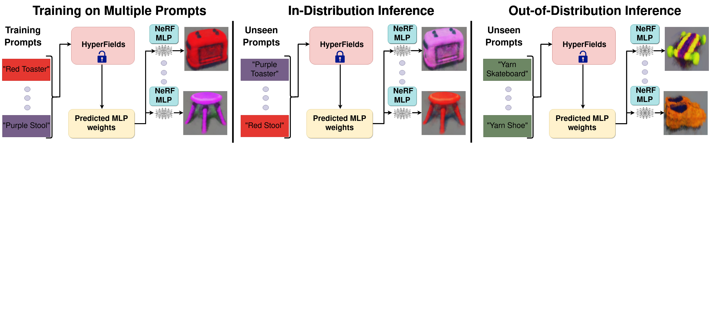

# HyperFields: Towards Zero-Shot Generation of NeRFs from Text [ICML 2024]


[Sudarshan babu*<sup>&dagger;</sup>](https://people.cs.uchicago.edu/~sudarshan/), [Richard Liu*<sup>&ddagger;</sup>](https://rgliu.com/), [Avery Zhou*<sup>&dagger;&ddagger;</sup>](https://github.com/AveryZhou), [Michael Maire <sup>&ddagger;</sup>](https://people.cs.uchicago.edu/~mmaire/), [Gregory Shakhnarovich <sup>&dagger;</sup>](https://home.ttic.edu/~gregory/), [Rana Hanocka <sup>&ddagger;</sup>](https://people.cs.uchicago.edu/~ranahanocka/) 

&dagger; Toyota Technological Institute at Chicago, &ddagger; University of Chicago, * equal contribution

Abstract: We introduce HyperFields, a method for generating text-conditioned NeRFs with a single forward pass and (optionally) some finetuning. Key to our approach are: (i) a dynamic hypernetwork, which learns a smooth mapping from text token embeddings to the space of Neural Radiance Fields (NeRFs); (ii) NeRF distillation training, which distills scenes encoded in individual NeRFs into one dynamic hypernetwork. These techniques enable a single network to fit over a hundred unique scenes. We further demonstrate that HyperFields learns a more general map between text and NeRFs, and consequently is capable of predicting novel in-distribution and out-of-distribution scenes --- either zero-shot or with a few finetuning steps. Finetuning HyperFields benefits from accelerated convergence thanks to the learned general map, and is capable of synthesizing novel scenes 5 to 10 times faster than existing neural optimization-based methods. Our ablation experiments show that both the dynamic architecture and NeRF distillation are critical to the expressivity of HyperFields.

<!-- ### [[Project Page](https://threedle.github.io/hyperfields/)] [[ArXiv]()] -->
<a href="http://arxiv.org/abs/2310.17075"></a>
<a href="https://threedle.github.io/hyperfields"></a>




## Installation


```
pip install -r requirements.txt

bash scripts/install_ext.sh

pip install ./raymarching
```
Note: We mainly build on [Stable-Dreamfusion](https://github.com/ashawkey/stable-dreamfusion) repo so our installation is same as theirs.

#### System Requirements
- Python 3.10
- CUDA 11.7
- 48 GB GPU


## Training the teacher networks
The instructions to train teachers for various shapes are in scripts.txt, here we just go over bowls
```
python main.py \ 
--text prompts/bowl.txt \
--iters 100000 -O --ckpt scratch \
 --project_name 10_pack -O \
--workspace hamburger_yarn \ 
--num_layers 6 --hidden_dim 64 \ 
--lr 0.0001 --WN None --init ortho \ 
--exp_name bowl_teacher --skip \
--albedo_iters 6000000 \
--conditioning_model bert \ 
--eval_interval 10 \ 
--arch detach_dynamic_hyper_transformer \
--meta_batch_size 3 \
--train_list 0 1 2 3 4 --test_list 0 

```

## Training the student HyperFields network
```
# Training student network learns all the shape color pairs in the training set and performs zero-shot generalization
#teacher_list.txt contains the path of the teacher networks
python main.py \
--text prompts/all_train_obj.txt \
--iters 100000  --ckpt scratch \
--project_name 10_pack -O \
--workspace hamburger_yarn 
--num_layers 6 --hidden_dim 64 \
--lr 0.0001 --WN None --init ortho \  
--exp_name all_student --skip \
--albedo_iters 6000000 \
--conditioning_model bert \
--eval_interval 50 \
--arch detach_dynamic_hyper_transformer \ 
--meta_batch_size 2 \ 
--load_teachers teacher_list.txt 
--lambda_stable_diff 0 \
--dist_image_loss --not_diff_loss \
--teacher_size 5 --test_list 0 \
--train_list  0 1 2 3 4  5 6 7 8 9 10 11 12 13 14 15 16 17 18  20 21 22 23 24 25 26 27 28 29 30 31 32 33 34 35 36 37 38 39 40 41 42 43 44 45 46 47 48 49

```
## Downloading and loading checkpoints
We have a [google drive](https://drive.google.com/file/d/10EaY6SfN1JPVoei8scin-B9xV5ZuX5y7/view?usp=drive_link) with all the teacher networks and the student network that is capable of zero-shot generalization
```
#To load and evaluate pre-trained checkpoint, in this case we load the pot_teacher model.
python main_eval.py \ 
--text prompts/test_final.txt \
--iters 100000  --ckpt latest \
--project_name 10_pack -O \
--workspace hamburger_yarn \
--num_layers 6 --hidden_dim 64 
--lr 0.0001 --WN None --init ortho \ 
--exp_name all_student --skip \
--albedo_iters 6000000 \
--conditioning_model bert --eval_interval 1 \
--arch detach_dynamic_hyper_transformer \
--meta_batch_size 2 \
--load_teachers teacher_list.txt \
--lambda_stable_diff 0 \ --dist_image_loss \
--not_diff_loss --teacher_size 5 --train_list 0  \
--test_list  0 1 2 3 4  5 6 7 8 9 10 11 12 13 14 15 16 17 18 19 20 21 22 23 24 25 26 27 28 29 30 31 
```


### Note on Reproducibility
Due to the sensitivity of SDS optimization and some non determinism, results can vary across different runs even when fully seeded. If the result of the optimization does not match the expected result, try re-running the optimization. Typically within 3 runs the desired results should be obtained.

## Acknowledgements
We build upon [Stable-Dreamfusion](https://github.com/ashawkey/stable-dreamfusion) and [Trans-INR](https://github.com/yinboc/trans-inr). We thank them for their contribution.

## Citation
```
@article{babu2023hyperfields,
title={HyperFields: Towards Zero-Shot Generation of NeRFs from Text},
author={Babu, Sudarshan and Liu, Richard and Zhou, Avery and Maire, Michael and Shakhnarovich, Greg and Hanocka, Rana},
journal={arXiv preprint arXiv:2310.17075},
year={2023}
}
```


