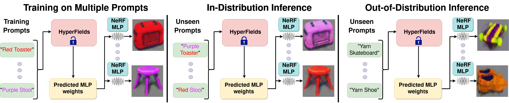

# HyperFields
The offcial website for HyperFields
# HyperFields: Towards Zero-Shot Generation of NeRFs from Text

[Sudarshan babu*<sup>&dagger;</sup>](https://people.cs.uchicago.edu/~sudarshan/), [Richard Liu*<sup>&ddagger;</sup>](https://rgliu.com/), [Avery Zhou*<sup>&dagger;&ddagger;</sup>](https://github.com/AveryZhou), [Michael Maire <sup>&ddagger;</sup>](https://people.cs.uchicago.edu/~mmaire/), [Gregory Shakhnarovich <sup>&dagger;</sup>](https://home.ttic.edu/~gregory/), [Rana Hanocka <sup>&ddagger;</sup>](https://people.cs.uchicago.edu/~ranahanocka/) 

&dagger; Toyota Technological Institute at Chicago, &ddagger; University of Chicago, * equal contribution

Abstract: We introduce HyperFields, a method for generating text-conditioned NeRFs with a single forward pass and (optionally) some finetuning. Key to our approach are: (i) a dynamic hypernetwork, which learns a smooth mapping from text token embeddings to the space of Neural Radiance Fields (NeRFs); (ii) NeRF distillation training, which distills scenes encoded in individual NeRFs into one dynamic hypernetwork. These techniques enable a single network to fit over a hundred unique scenes. We further demonstrate that HyperFields learns a more general map between text and NeRFs, and consequently is capable of predicting novel in-distribution and out-of-distribution scenes --- either zero-shot or with a few finetuning steps. Finetuning HyperFields benefits from accelerated convergence thanks to the learned general map, and is capable of synthesizing novel scenes 5 to 10 times faster than existing neural optimization-based methods. Our ablation experiments show that both the dynamic architecture and NeRF distillation are critical to the expressivity of HyperFields.

<!-- ### [[Project Page](https://threedle.github.io/hyperfields/)] [[ArXiv]()] -->
<a href=""></a>
<a href="https://threedle.github.io/hyperfields"></a>




## Installation


```
pip install -r requirements.txt

bash scripts/install_ext.sh

pip install ./raymarching
```
Note: We mainly build on [stable-dreamfusion](https://github.com/ashawkey/stable-dreamfusion) repo so our installation is same as theirs.

#### System Requirements
- Python 3.10
- CUDA 11.7
- 48 GB GPU


## Training the teacher networks
The instructions to train teachers for various shapes are in scripts.txt, here we just go over bowls
```
# Training teacher for bowls
python main.py \
--text ./txt/base_color_bowl_v3.txt \
--iters 100000 -O --ckpt scratch \
--project_name 10_pack -O 
--workspace hamburger_yarn \ 
--num_layers 6  --hidden_dim 64 \
--lr 0.0001 --WN None --init ortho \
--exp_name bowl_teacher  \ 
--albedo_iters 6000000 \ 
--conditioning_model bert \
--conditioning_dim 64  \
--eval_interval 10  \
--arch detach_dynamic_hyper_transformer \ 
--meta_batch_size 3 \
--train_list 0 1 2 3 4 \ 
--test_list 0 \
```


